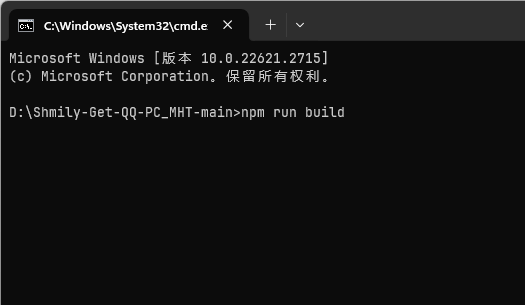

# 开始吧

## 概述

对于用户来说, 希望一个软件足够简单,打开一个窗口,点击一个按钮, 就可以得到最终的 `结果` . 这称为黑盒, 所有的事情都被这个按钮挡住的了,不利于 debug 与 程序的解耦.

若有些人只希望导出 MobileQQ 的数据做一个自己的 Ai 机器人 ,并不需要`Show(展示数据)`. 如果按照以上的设计,他还需要从上述按钮获取的展示 `结果` 逆向为数据.

所以 Shmily 的使用是在 `程序解耦` 与 `使用便利` 之间取舍. 我希望 Shmily 对于不懂编程的人能简单使用, 同时也能足够解耦拆分足够细, 不让开发者 [重造轮子](https://baike.baidu.com/item/%E9%87%8D%E9%80%A0%E8%BD%AE%E5%AD%90/16837040), 中间的纽带就是文档了.

因为我自身是 Shimly 的开发者,很容易一叶障目, 所以我也很希望你们从各种角度对文档提出各方面的问题来完善文档. 欢迎 [提出建议](https://github.com/lqzhgood/Shmily/issues/new)

基于以上 Shmily 的使用会被拆分为很多个步骤, 而且没有 GUI 界面, 这会让人看起来感觉很复杂, 但我保证, <b>每个步骤基本都是拷贝文件, 执行一行命令 完了~</b> 别担心~


## 学前班 ( 如何开始一个项目 )

大部分项目并不会打包为有界面的 `"exe"`, 而是需要从源码运行, `Github` 是一个存储源码的网站, 本章介绍如何开始一个存储在 `Github` 项目


::: info 实操

以 `Windows11`、`https://github.com/lqzhgood/Shmily-Get-QQ-PC_MHT`(电脑QQ聊天记录) 为例

在每个章节最后均有实操示例

:::

如果你非程序员, 可以展开这里获取一些基本知识来开始一个项目

<details>
  <summary>学前班教程</summary>


### 1. 下载源码


在 Github 项目中, 点击下图中 `Download ZIP` 即可下载当前项目源码


::: info 实操

打开 `https://github.com/lqzhgood/Shmily-Get-QQ-PC_MHT` 并下载 <br />
下载后解压缩 `Shmily-Get-QQ-PC_MHT-main.zip` 到 `D:\Shmily-Get-QQ-PC_MHT-main`

:::


### 2. 安装项目运行时环境


::: tip 什么是运行时环境?

顾名思义: 运行这个 "东西" 所需要的 "环境"


例如你有一个 `风景.mp4` 的视频, 如果你要播放出来, 那么你需要一个 `视频播放器` <br />
那么运行 `风景.mp4` 所需要环境就是 `视频播放器`

下载的 `源码` 也需要对应的 `(运行时)环境`

:::

项目的源码可能是由不同 `编程语言` 书写的, 相应的 `编程语言` 需要对应的 `运行时`, 如 `C++源代码` 需要 `C++运行时`,  `Java源代码` 需要 `Java运行时`


#### 2.1 如何判断项目的 `编程语言`

##### 2.1.1 按照项目的特征(推荐)

|  编程语言   | 特征  |
|  ----  | ----  |
| nodejs  | [有 `package.json` 文件, 或大量 `.js` `.ts` 后缀文件](../setup-runtime/assets/is-nodejs.png)  |
| python  | [有 `requirements.txt` 文件, 或大量 `.py` 后缀文件](../setup-runtime/assets/is-python.png) |
| java  | [大量 `.java` 后缀文件](../setup-runtime/assets/is-java.png) |

##### 2.1.2 `Github` 会自动标注主要语言(并不准确)


#### 2.2 根据 `编程语言` 安装对应的 `运行时`

|  编程语言   | 安装`运行时`  |
|  ----  | ----  |
| nodejs  | [教程](../setup-runtime/nodejs.md)  |
| python  | [教程](../setup-runtime/python.md)  |
| java  | [教程](../setup-runtime/java.md)  |
| php  | [教程](../setup-runtime/php.md)  |
| docker  | [教程](../setup-runtime/docker.md)  |


::: info 实操
打开 `D:\Shmily-Get-QQ-PC_MHT-main`, 项目中有 `package.json` 文件, 所以这是一个 `nodejs` 项目 <br />
按照 [nodejs 教程](../setup-runtime/nodejs.md), <br />
下载 Windows 平台 `https://nodejs.org/dist/v18.18.2/node-v18.18.2-x64.msi` 并安装 <br />
在项目目录 `D:\Shmily-Get-QQ-PC_MHT-main` 执行 `npm i` 安装依赖 <br />
:::


### 3. 使用

参照具体项目中的文档继续

::: info 实操
打开 `https://github.com/lqzhgood/Shmily-Get-QQ-PC_MHT`, 参照项目文档中的 <b>使用</b> 部分

0. 安装 node 环境
    > 上述 2.2 已经安装
1. 安装 php 环境
    > 参照2.2 安装 php 环境
2. 导出的 .mht 文件放入 input
    > 从 PC QQ 的聊天管理器中导出 `.mht` 格式的聊天记录, 并放入 `input` 文件夹(如没有则新建)

    ```
    // 文件夹结构

    -\
      - node_modules
      - input       <--- 如果没有这个文件夹则新建
        - xxx.mht   <--- 放到这里
      - index.js
      - package.json
      - README.md
    ```
3. 修改 `config.js`
    > 打开 `config.js` 按照里面的说明和示例进行修改
4. 执行 npm run build
   > 在项目目录中打开 `命令提示符`
   
   然后运行 `npm run build` (确保是当前项目目录下 D:\Shmily-Get-QQ-PC_MHT-main)
   
5. 复制 merger 里的文件到 \dist\data\
6. dist 获取 数据文件 和 资源文件

    ```
    // 文件夹结构

    -\
      - node_modules
      - input
        - xxx.mht
      - dist
        - data                              <-- 数据文件(夹)
            - qq-pc
        - QQ_PC_MHT-12345678-20230101.json  <-- 资源文件
        - ...                               <-- 其他过程文件及日志
      - index.js
      - package.json
      - README.md
    ```
:::

### 4. 其他说明
以上是一个 `Github` 项目运行的完整流程

以通过 `Shmily` 导出 `电脑QQ聊天记录` 为例, 至少需要运行两个 `Github` 项目,

1. Get 获取数据, https://github.com/lqzhgood/Shmily-Get-QQ-PC_MHT
    > 得到 `数据文件(data)` 和  `资源文件(QQ_PC_MHT-12345678-20230101.json)`
2. Show 显示数据, https://github.com/lqzhgood/Shmily-Show/
    > 使用 Get 得到的 "文件" 生成最后的 "显示" 结果

你可通过多个 `Get` 获取多个 "文件", 同时导入 `Show` 获得集中 "显示" 结果

</details>


## 开始项目


###  大致步骤

`Get(获取数据)` ---> `Merger(合并数据)` ---> `Show(展示数据)`

::: tip
大多数情况下 `Merger(合并数据)` 可以跳过
:::


### 1. Get-获取数据

[参考 Get 文档](./get.md)

### 2. Merger-合并数据 (可选)

[参考 Merger 文档](./merger.md)

### 3. Show-展示数据

[参考 Show 文档](./show.md)
